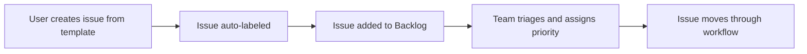

# GitHub Project Board Setup

This document provides instructions for setting up and configuring the "Backend Roadmap" GitHub Project board to work effectively with the issue templates and labeling system.

## Overview

The GitHub Project board "Backend Roadmap" will serve as the central hub for tracking development progress, organizing work, and managing the project backlog. This setup will automatically integrate with the issue templates and labels defined in this repository.

## Project Board Setup

### 1. Creating the Project Board

1. Navigate to your repository on GitHub
2. Go to the "Projects" tab
3. Click "New project"
4. Choose "Board" layout
5. Name it "Backend Roadmap"
6. Add description: "Tracking development progress for the University Grade Management System"

### 2. Board Columns Configuration

Set up the following columns in order:

#### Column 1: 📋 Backlog
- **Purpose**: New issues and planned work
- **Automation**: Auto-add new issues and PRs
- **Cards**: Issues with labels: `P0`, `P1`, `P2`, `P3`

#### Column 2: 🏗️ In Progress
- **Purpose**: Work currently being developed
- **Automation**: Move here when PR is opened or issue is assigned
- **Cards**: Issues with assignees and PRs in draft/review

#### Column 3: 👀 In Review
- **Purpose**: Pull requests under review
- **Automation**: Move here when PR is ready for review
- **Cards**: PRs with "ready for review" status

#### Column 4: ✅ Done
- **Purpose**: Completed work
- **Automation**: Move here when PR is merged or issue is closed
- **Cards**: Closed issues and merged PRs

### 3. Automation Rules

Configure the following automation rules to streamline workflow:

#### Auto-add to Project
```yaml
# When issues are opened
Trigger: Issue opened
Action: Add to "Backlog" column

# When PRs are opened
Trigger: Pull request opened
Action: Add to "In Progress" column
```

#### Move Between Columns
```yaml
# Move to In Progress
Trigger: Issue assigned OR Pull request opened
Action: Move to "In Progress" column

# Move to In Review
Trigger: Pull request marked as ready for review
Action: Move to "In Review" column

# Move to Done
Trigger: Issue closed OR Pull request merged
Action: Move to "Done" column
```

### 4. Filtering and Views

Set up custom filters for better organization:

#### By Type
- **Bug Filter**: `label:bug`
- **Feature Filter**: `label:feature`
- **Chore Filter**: `label:chore`

#### By Priority
- **Critical**: `label:P0`
- **High Priority**: `label:P1`
- **Medium Priority**: `label:P2`
- **Low Priority**: `label:P3`

#### By Area
- **Authentication**: `label:auth`
- **Database**: `label:db`
- **Grades**: `label:grades`
- **Infrastructure**: `label:infra`
- **CI/CD**: `label:ci`
- **Reports**: `label:reports`

#### By Size
- **Small Tasks**: `label:S`
- **Medium Tasks**: `label:M`
- **Large Tasks**: `label:L`

### 5. Custom Fields (Optional)

Add custom fields for enhanced tracking:

#### Sprint Field
- **Type**: Iteration
- **Purpose**: Track sprint assignments
- **Values**: Sprint 1, Sprint 2, etc.

#### Effort Estimation
- **Type**: Number
- **Purpose**: Story points or time estimates
- **Range**: 1-13 (Fibonacci sequence)

#### Component
- **Type**: Select
- **Purpose**: More granular area tracking
- **Options**: Frontend, Backend, Database, API, Tests, Docs

## Integration with Issue Templates

### Automatic Label Application

When users create issues using the templates:

1. **Bug Report Template** → Automatically gets `bug` label
2. **Feature Request Template** → Automatically gets `feature` label  
3. **Chore Template** → Automatically gets `chore` label

### Template-to-Board Flow



## Workflow Examples

### Bug Report Workflow
1. User reports bug using bug_report.yml template
2. Issue created with `bug` label
3. Issue automatically added to "Backlog" column
4. Maintainer adds priority (`P0`-`P3`) and area labels
5. Developer assigns themselves → moves to "In Progress"
6. PR created → stays in "In Progress"
7. PR ready for review → moves to "In Review"
8. PR merged → moves to "Done"

### Feature Request Workflow
1. User requests feature using feature_request.yml template
2. Issue created with `feature` label
3. Issue automatically added to "Backlog" column
4. Team discusses and adds priority/area labels
5. Feature approved and assigned → moves to "In Progress"
6. Development and PR process follows same pattern

## Board Management Best Practices

### Daily/Weekly Maintenance
- **Daily**: Review "In Progress" and "In Review" columns
- **Weekly**: Triage new items in "Backlog"
- **Sprint Planning**: Move prioritized items from "Backlog" to "In Progress"

### Labeling Consistency
- Apply priority labels (`P0`-`P3`) during triage
- Add area labels (`auth`, `db`, `grades`, etc.) for organization
- Use size labels (`S`, `M`, `L`) for planning

### Communication
- Use issue comments for status updates
- Reference issues in commit messages: `fixes #123`
- Update PR descriptions to link to issues: `Closes #123`

## GitHub Actions Integration (Optional)

Consider adding GitHub Actions for enhanced automation:

### Auto-labeling Based on File Changes
```yaml
name: Auto Label
on:
  pull_request:
    types: [opened, synchronize]

jobs:
  label:
    runs-on: ubuntu-latest
    steps:
      - uses: actions/labeler@v4
        with:
          repo-token: "${{ secrets.GITHUB_TOKEN }}"
```

### Project Board Automation
```yaml
name: Project Board Automation
on:
  issues:
    types: [opened, closed]
  pull_request:
    types: [opened, closed, merged]

jobs:
  add-to-project:
    runs-on: ubuntu-latest
    steps:
      - uses: actions/add-to-project@v0.3.0
        with:
          project-url: https://github.com/BOUTCHOUANG1/University-Grade-MS/projects/1
          github-token: ${{ secrets.ADD_TO_PROJECT_PAT }}
```

## Setup Checklist

- [ ] Create "Backend Roadmap" project board
- [ ] Configure four main columns (Backlog, In Progress, In Review, Done)
- [ ] Set up automation rules for moving cards
- [ ] Create filtered views for different label combinations
- [ ] Test workflow with sample issue from template
- [ ] Document project board URL for team reference
- [ ] Train team members on board usage

## Maintenance and Evolution

- **Monthly**: Review board effectiveness and adjust columns/automation
- **Quarterly**: Analyze completed work patterns and optimize process
- **As needed**: Add new labels or columns based on team feedback

The project board will provide valuable insights into development velocity, bottlenecks, and progress toward goals when properly maintained and utilized by the team.